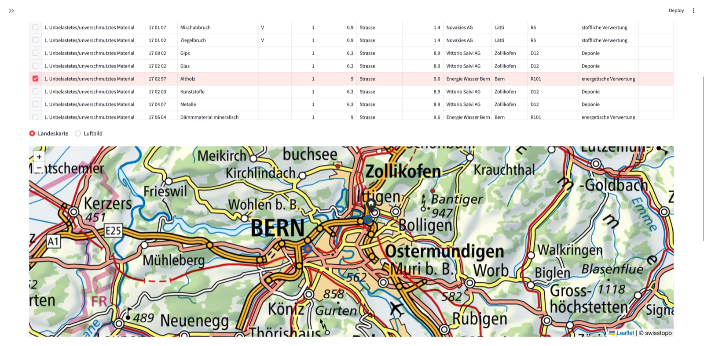

# Abfalltool – Entsorgungslisten für Schweizer Baustellen

Auf jeder Baustelle stellt sich dieselbe Frage: Wohin mit dem Material? Welche Anlage
darf diesen Abfallcode überhaupt annehmen, wie weit ist sie weg, und wird dort verwertet
oder nur abgelagert? Die Antworten stecken im Abfallanlagen-Verzeichnis (egov.swiss) des BAFU.
Die Daten sind aber nur einzeln abrufbar und nicht nach Distanz filterbar.
Wer eine Entsorgungsliste für ein Entsorgungskonzept erstellt, sucht sie bisher von Hand zusammen.
Eine Optimierung nach Transportdistanz ist nur sehr mühsam möglich.

Dieses Werkzeug liest den Export von egov.swiss ein und beantwortet die Frage für alle Positionen einer
Baustelle auf einmal: bewilligte Anlagen pro Abfallcode, sortiert nach Verwertung vor
Beseitigung (VVEA) und nach Strassendistanz mit Lastwagenprofil. Das Ergebnis ist eine
Excel-Liste in der Struktur der BAFU-Entsorgungstabelle Bauabfälle, dazu eine Karte.

Entstanden ist es aus der Praxis im Untertagbau. Es läuft lokal auf dem eigenen Rechner;
ausser der Adresssuche für fehlende Koordinaten verlässt nichts den Computer.

Datengrundlage ist der Export «Datenexport Abfallanlagen» von eGov.Swiss (BAFU).

**Stand:** Strassendistanzen über Valhalla (mit Luftlinie als Rückfall und Vorfilter),
Rangfolge nach VVEA-Verfahrenshierarchie. Die ökologische Bilanzierung (CO2 und UBP)
folgt in der nächsten Version.

## Schnellstart mit Oberfläche

Alle Dateien in denselben Ordner legen, dann:

- **macOS:** Doppelklick auf `start.command`
- **Windows:** Doppelklick auf `start.bat`

Beim ersten Start richtet sich die Arbeitsumgebung selbst ein (ein bis zwei Minuten),
danach öffnet sich die Oberfläche im Browser. Sie führt durch alle Schritte:
Export einlesen, Koordinaten ergänzen, Baustelle festlegen, Liste erstellen und als
Excel herunterladen. Voraussetzung ist eine Python-Installation
(macOS bringt sie mit, unter Windows aus dem Microsoft Store oder von python.org).

Die Oberfläche zeigt die Anlagen auf einer Karte mit swisstopo-Hintergrund (Landeskarte
oder Luftbild), Punkte sind anklickbar, und eine in der Tabelle gewählte Zeile wird
hervorgehoben. Über den Knopf «GeoJSON für QGIS erzeugen» entstehen dieselben Daten als
Dateien für die genauere Auswertung in QGIS.

Wer lieber über die Kommandozeile arbeitet, findet unten alle Einzelschritte.

## Einrichtung für die Kommandozeile

    py -m pip install -r requirements.txt

Die Beispiele verwenden `py` (Windows). Auf macOS und Linux heisst der Befehl `python3`.

Alle Dateien gehören in denselben Ordner, die Skripte importieren sich gegenseitig.

---

## Ablauf bei einem neuen BAFU-Export

Immer in dieser Reihenfolge, weil der Import die Anlagentabelle neu aufbaut:

    py import_bafu.py Export.xlsx                # 1. Daten einlesen
    py geokodierung.py                           # 2. fehlende Koordinaten ergänzen
    py kontrolle.py --status unplausibel         # 3. verdächtige Koordinaten prüfen

Schritt 2 dauert beim ersten Mal einige Minuten. Danach liegen die Antworten in
`geocode_cache.json` und der Lauf geht in Sekunden. Manuelle Korrekturen aus
`koordinaten_manuell.json` werden am Ende von Schritt 1 automatisch wieder angewendet.

### Was die Schritte 2 und 3 tun

**Schritt 2** nimmt alle Anlagen mit Status `fehlt`, also leere oder unbrauchbare
Koordinaten. Pro Anlage werden alle Suchvarianten abgefragt (Strasse mit Hausnummer,
Flur- oder Objektname mit Ort, Strasse allein, PLZ mit Ort) und der **genaueste**
Treffer übernommen. Ein nur ortsgenauer Treffer kommt erst zum Zug, wenn keine
Variante eine Adresse liefert.

**Schritt 3** betrifft die Anlagen mit Status `unplausibel`. Ihre Koordinate ist
formal gültig, liegt aber über 20 km von den anderen Anlagen mit gleicher PLZ entfernt.
Ein Zahlendreher (zwei vertauschte Ziffern) wird schon beim Import erkannt und
korrigiert. Die übrigen Fälle werden nur markiert und nicht automatisch ersetzt: Meist
ist dort nicht die Koordinate falsch, sondern die Adresse ist die Firmen- oder
Postadresse, etwa bei Deponien im ganzen Kanton Graubünden mit Adresse Chur. Ein
Adresstreffer würde den Standort dann verschlechtern. Diese Fälle in der Karte prüfen
und nur bei Bedarf mit `korrekturen.py` von Hand setzen.

Einzelne Abfrage zum Ausprobieren, zeigt Rohantwort und Auswertung:

    py geokodierung.py --test "Seestrasse 12 6052 Hergiswil"
    py geokodierung.py --limit 20          # Probelauf mit den ersten 20

Vereinzelt antwortet der Dienst auf eine Suchvariante mit `HTTP Error 400`. Das Skript
meldet das, probiert die nächste Variante und läuft weiter. Entscheidend ist die
Schlusszeile: dort steht, wie viele ohne Treffer geblieben sind.

Ab dem zweiten Import entsteht zusätzlich `aenderungen_JJJJ-MM-TT.csv` mit neuen und
entfallenen Bewilligungen. Die bestehende Datenbank wird erst ersetzt, wenn der Import
vollständig durchgelaufen ist.

---

## Regelmässige Arbeit

### Baustelle anlegen

    py baustellen.py Sedrun 2706600,1166200 --notiz "Portal Nord"
    py baustellen.py                        # anzeigen
    py baustellen.py Sedrun --loeschen

Koordinate als LV95 `E,N` oder WGS84 `lat,lon`. Gespeichert in `baustellen.json`.
Danach genügt überall der Name statt der Koordinate.

### Einzelnen Abfallcode abfragen

    py abfrage.py "17 05 06" --baustelle Sedrun
    py abfrage.py 170506 --baustelle Sedrun --nur-endverfahren --limit 15 --csv resultat.csv

Gefiltert wird auf aktive Anlagen mit am Stichtag gültiger Bewilligung
(Standard heute, sonst `--stichtag JJJJ-MM-TT`).

### Liste aus einer Codevorlage erstellen

    py liste.py --vorlagen
    py liste.py bauabfaelle --baustelle Sedrun --umkreis 50 --excel liste.xlsx
    py liste.py tunnel --baustelle Sedrun --vorschlaege 3 --excel liste.xlsx

Die Vorlagen in `vorlagen.json` folgen der **BAFU-Entsorgungstabelle Bauabfälle**
(VVEA-Vollzugshilfe, Modul «Bauabfälle»): Abfallart, Details, LVA-Code, genereller
Entsorgungsweg, Verwertungspflicht, Entsorgungsort und Mengen in m3 fest, m3 lose und
Tonnen. Damit passt der Output ins Entsorgungskonzept, das im Baubewilligungsverfahren
eingereicht wird.

| Vorlage | Inhalt |
|---|---|
| `bauabfaelle` | 36 Positionen, unbelastetes und belastetes Material nach BAFU-Tabelle |
| `tunnel` | 15 Positionen: Ausbruch, Betriebsabfälle Installationsplatz, Sonderabfälle Werkstatt |

Beide sind fachlich zu prüfen und projektweise anzupassen. Alle Codes sind gegen den
LVA-Katalog des Exports verifiziert. Die Entsorgungswege sind gekürzt wiedergegeben;
massgebend bleibt die Vollzugshilfe.

**Sortierung.** Standard ist `--sortierung auto`: Bei verwertungspflichtigen Positionen
(Spalte `v_pflicht` = `V`) wird zuerst nach Verfahrensstufe und erst danach nach Distanz
sortiert, sonst nur nach Distanz. Mit `--sortierung distanz` oder `--sortierung verwertung`
lässt sich das erzwingen; `abfrage.py` kennt dieselbe Option.

Die Verfahrensstufe steht in `bewertung.py` und folgt der Abfallhierarchie der VVEA:

| Stufe | Bedeutung | Verfahren |
|---|---|---|
| 1 | stoffliche Verwertung | R2–R11, R160 |
| 2 | energetische Verwertung | R101, R103, R104 |
| 3 | thermische Beseitigung | D101–D104 |
| 4 | Behandlung | D2, D8, D9, D160 |
| 5 | Deponie | D1, D5, D12 |
| 6 / 7 | Zwischenlager, kein Endverfahren | R151–R153 / D151–D153 |

Ist eine Position verwertungspflichtig und liegt der Vorschlag trotzdem auf Stufe 3 oder
schlechter, erscheint in `hinweis` der Vermerk, dass die Nichtverwertung schriftlich zu
begründen ist. Positionen ohne Treffer werden ausgewiesen statt weggelassen.

Der Export enthält zusätzlich leere Spalten `transportunternehmen`, `transportmittel`
und `bemerkung`. Die BAFU-Tabelle kennt sie nicht, für den Baustellenbetrieb sind sie
aber nötig und lassen sich so direkt ausfüllen.

---

## Strassendistanzen (Routing)

Ohne Routing rechnet das Tool mit Luftlinie. In der Spalte `distanz_quelle` steht bei
jedem Vorschlag, welcher Wert verwendet wurde.

### Valhalla einmalig aufsetzen (Docker)

Valhalla läuft in Docker, auf macOS und Windows mit derselben `docker-compose.yml`.

**macOS:** [Docker Desktop](https://www.docker.com/products/docker-desktop/) installieren
und starten.

**Windows:** [Docker Desktop](https://www.docker.com/products/docker-desktop/) installieren.
Bei der Installation die Option «Use WSL 2» aktiviert lassen; fehlt WSL noch, bietet
Docker Desktop die Einrichtung an (danach einmal neu starten). Die Befehle unten laufen
in PowerShell.

Auf beiden Systemen in den Einstellungen von Docker Desktop «Start Docker Desktop when you
sign in» aktivieren, sonst startet Valhalla nach einem Neustart nicht von selbst. Für den
Aufbau der Kacheln braucht Docker genügend Arbeitsspeicher; mit weniger als etwa 8 GB
kann der erste Start abbrechen.

Dann im Ordner mit der `docker-compose.yml`:

    docker compose up -d
    docker compose logs -f

Der erste Start lädt den Schweiz-Extrakt von OpenStreetMap samt Höhendaten und baut
daraus die Routing-Kacheln. Das dauert je nach Rechner 30 bis 60 Minuten und braucht
einige GB Platz. Die Höhendaten (`build_elevation=True`) werden nicht für die Routenwahl
gebraucht, sondern um pro Strecke Steigung und Gefälle zu erfassen – Grundlage für einen
späteren topografischen Zuschlag in der CO2-Bilanz. Danach läuft der Dienst unter
`http://localhost:8002` und startet mit Docker automatisch mit. Gerechnet wird mit dem
Lastwagenprofil (Gewicht, Höhe, Breite), das in `routing.py` unter `LKW` angepasst
werden kann.

### Strecken berechnen und speichern

Erreichbarkeit prüfen, dann für eine Baustelle rechnen:

    py routing.py --test
    py routing.py --baustelle Sedrun --vorlage tunnel --top 20 --umkreis 60 --hoehen
    py routing.py --cache          # welche Baustellen sind gerechnet

Läuft Valhalla auf einem anderen Rechner im selben Netz, etwa auf einem Mac:
`--host http://<name-des-rechners>.local:8002`. Unter Windows als Server muss die Firewall
Port 8002 zulassen.

Berechnet werden nur die nächstgelegenen Anlagen pro Code (`--top`), vorgefiltert über
die Luftlinie (`--umkreis`). Die Ergebnisse landen in **`routen.db`**. Diese Datei ist
vom Anlagenimport unabhängig und übersteht jeden neuen BAFU-Export.

Jede Strecke ist mit ihrem Startpunkt gespeichert (Koordinate und Baustellenname), gilt
also nur ab dieser Baustelle. Eine zweite Baustelle bekommt eigene Einträge.

`--hoehen` trägt pro Strecke die kumulierte Steigung und das Gefälle nach. Das kostet je
eine zusätzliche Anfrage pro Strecke und ist deshalb optional, liefert aber die Basis für
die topografische Korrektur der Emissionen.

### Danach ohne Docker weiterarbeiten

`abfrage.py` und `liste.py` nehmen automatisch die gespeicherte Strassendistanz, wo eine
vorliegt, sonst die Luftlinie. Nimm `routen.db` einfach mit auf den Stick, dann brauchst
du Valhalla unterwegs nicht. Für eine neue Baustelle oder einen grösseren Umkreis lässt
du `routing.py` einmal auf dem Rechner mit Valhalla nachlaufen.

Koordinaten werden für den Cache auf 10 m gerundet, damit kleine Korrekturen an einem
Standort nicht jede Strecke ungültig machen.

---

## Koordinaten prüfen und korrigieren

### Kontrolle nach der Geokodierung

**1. Überblick verschaffen.** Zeigt, wie viele Anlagen aus dem Export, aus der
Geokodierung oder von Hand stammen:

    py kontrolle.py

Erwartbar ist, dass fast alles `geokodiert` ist und nur ein kleiner Rest
`geokodiert_grob`. Ein grosser grober Anteil deutet auf ein Problem hin, etwa einen
veralteten `geocode_cache.json` nach einer Änderung der Suchlogik. Dann Cache löschen
und Schritt 2 wiederholen.

**2. Die unsicheren Fälle einzeln prüfen.** Das sind die groben Treffer und die
unplausiblen Werte:

    py kontrolle.py --status geokodiert_grob,unplausibel --csv pruefen.csv

Die CSV enthält pro Anlage einen Link auf map.geo.admin.ch mit Fadenkreuz und Luftbild.
Ein Klick zeigt, ob der Punkt auf der Anlage liegt oder irgendwo im Dorfzentrum.

**3. Visuell über die Karte prüfen**, wenn es mehrere sind:

    py kontrolle.py --status geokodiert_grob,geokodiert --geojson pruefen.geojson

Die GeoJSON-Datei in QGIS öffnen oder auf map.geo.admin.ch ziehen. Ausreisser fallen
sofort auf, etwa ein Punkt im See oder im falschen Tal.

**4. Nur die eigene Region prüfen**, das ist meist der effizienteste Weg:

    py kontrolle.py --baustelle Sedrun --umkreis 50 --csv region.csv

Statt aller Anlagen der Schweiz nur die, die für das aktuelle Projekt überhaupt in
Frage kommen. In der Spalte `koord_quelle` steht bei jeder, woher ihre Koordinate stammt.

**5. Falsche Punkte korrigieren** mit `korrekturen.py` (siehe unten). Danach steht die
Anlage auf `manuell` und bleibt bei jedem weiteren Import richtig.

### Korrigieren

Stimmt ein Punkt nicht: in map.geo.admin.ch an die richtige Stelle klicken, Koordinate
ablesen und setzen:

    py korrekturen.py 105400298 2666100,1211100 --notiz "ab map.geo.admin.ch"
    py korrekturen.py                        # anzeigen
    py korrekturen.py 105400298 --loeschen

Manuelle Werte haben Vorrang vor Geokodierung und Export und überleben jeden Import.

### Status in der Spalte `koord_status`

| Status | Bedeutung |
|---|---|
| `manuell` | von Hand gesetzt, höchste Priorität |
| `ok` | Originalwert aus dem Export, plausibel |
| `repariert` | LV03-Wert, vertauschte Achsen, fehlendes Präfix oder Zahlendreher korrigiert |
| `geokodiert` | über swisstopo adress- oder parzellengenau ermittelt |
| `geokodiert_grob` | nur Ortschaft, Gemeinde oder Flurname – kann einige km abweichen |
| `unplausibel` | über 20 km vom Median der Anlagen gleicher PLZ entfernt, wird verwendet, aber nicht ersetzt |
| `fehlt` | leer, nicht reparierbar und nicht geokodierbar |

---

## Datenqualität des Exports melden

    py datenqualitaet.py

erstellt `datenqualitaet_abfallanlagen.xlsx` mit drei Blättern: alle Anlagen mit
fehlender oder auffälliger Koordinate (Originalwert, Befund, Korrekturvorschlag mit
Quelle und Kartenlinks), die Einträge, die nach Testdaten aussehen, und Hinweise zur
Lesart. Erkannt werden unter anderem fehlende Werte, LV03-Werte, vertauschte Achsen,
Tippfehler, Zahlendreher und Adressen, die über 20 km vom Standort entfernt liegen.

Die Datei eignet sich als Rückmeldung an die Stellen, die die Daten pflegen. Die
Vorschläge stammen aus Umrechnung und Adresssuche und sind nicht vor Ort geprüft.
Am besten nach Import und Geokodierung ausführen, dann sind die Vorschläge vollständig.

---

## Dateien

| Datei | Zweck |
|---|---|
| `import_bafu.py` | Export einlesen, bereinigen, Datenbank schreiben |
| `geokodierung.py` | fehlende Koordinaten über swisstopo ergänzen |
| `korrekturen.py` | manuelle Koordinaten verwalten und anwenden |
| `kontrolle.py` | Koordinaten prüfen, Kartenlinks, GeoJSON |
| `datenqualitaet.py` | Prüfbericht zu fehlenden und fehlerhaften Koordinaten im Export |
| `baustellen.py` | Baustellen speichern |
| `abfrage.py` | Anlagen zu einem Abfallcode suchen |
| `liste.py` | Entsorgungsliste aus Codevorlage erstellen |
| `app.py` | Oberfläche im Browser (Streamlit), führt durch alle Schritte |
| `start.command` / `start.bat` | Startdatei für macOS bzw. Windows |
| `karte.py` | GeoJSON-Export für QGIS, ein Punkt je Anlage und Abfallcode |
| `bewertung.py` | Rangfolge der Entsorgungsverfahren nach VVEA-Hierarchie |
| `routing.py` | Strassendistanzen über Valhalla, mit Cache in `routen.db` |
| `docker-compose.yml` | Valhalla-Routing für die Schweiz |
| `koordinaten.py` | Parsen, Reparieren, LV95 ↔ WGS84, Luftlinie |
| `vorlagen.json` | Codevorlagen pro Baustellentyp |

Erzeugt werden `abfallanlagen.db`, `routen.db`, `geocode_cache.json`, `baustellen.json`,
`koordinaten_manuell.json` und die Änderungsprotokolle.

## Datenbank

- `anlagen` – eine Zeile pro Betriebsnummer, LV95 und WGS84, Status und Quelle der Koordinate
- `bewilligungen` – Betriebsnummer × Abfallcode × Verfahren mit Gültigkeit;
  `zwischenverfahren = 1` bei R/D151–153 (Zwischenlager oder Umschlag, kein Endverfahren)
- `abfallcodes`, `verfahren`, `anlagentypen`, `import_info`

## Datenquellen

| Quelle | Verwendung | Bedingungen |
|---|---|---|
| BAFU / eGov.Swiss, «Datenexport Abfallanlagen» | Anlagen, Abfallcodes, Bewilligungen | Konto nötig, Export selbst herunterladen; Nutzungsbedingungen des Portals beachten |
| swisstopo (api3.geo.admin.ch, wmts.geo.admin.ch) | Geokodierung fehlender Koordinaten, Kartenhintergrund | © swisstopo |
| OpenStreetMap (via Valhalla) | Strassennetz für die Routenberechnung | © OpenStreetMap-Mitwirkende, ODbL |
| BAFU, Vollzugshilfe VVEA, Modul «Bauabfälle» | Struktur der Vorlagen, Entsorgungswege, Verwertungspflicht | Entsorgungswege gekürzt wiedergegeben, massgebend ist die Vollzugshilfe |

Es werden keine Daten mitgeliefert. Der Export gehört nicht ins Repository und steht
in der `.gitignore`.

## Grenzen

Das Tool bereitet Informationen auf und ersetzt die fachliche Beurteilung nicht.
Eine Bewilligung sagt nichts über Kapazität, Preis oder Annahmebedingungen aus, und
die Einstufung des Materials (unverschmutzt, belastet) kommt aus der Untersuchung,
nicht aus diesem Werkzeug. Die Verfahrensstufen in `bewertung.py` folgen der
Abfallhierarchie der VVEA, sind aber eine fachliche Einordnung und keine Rechtsnorm.
Begleitschein- und Meldepflichten nach VeVA prüft das Tool nicht.
Es liefert Vorschläge, keine verbindliche Zuweisung. Im Export stecken vereinzelt
Testdatensätze des BAFU (z. B. «Test Novemberrelease 2021»).
